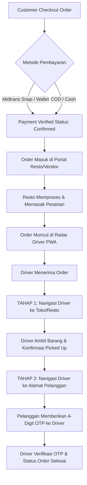

# 🚀 CicalengkaGO - Panduan Setup Sistem & Flow Operasional Aplikasi

Dokumen ini berisi panduan lengkap **Konfigurasi Sistem (Setup)** dan **Alur Kerja Aplikasi (App Flow)** untuk platform On-Demand Multi-Vendor Delivery **CicalengkaGO**.

---

## 📋 DAFTAR ISI
1. [Spesifikasi System & Requirements](#1-spesifikasi-system--requirements)
2. [Panduan Instalasi & Setup Lokal (XAMPP / Docker)](#2-panduan-instalasi--setup-lokal)
3. [Struktur Folder & Arsitektur MVC](#3-struktur-folder--arsitektur-mvc)
4. [Konfigurasi Environment & Database](#4-konfigurasi-environment--database)
5. [Integrasi Midtrans Payment & WhatsApp API](#5-integrasi-midtrans-payment--whatsapp-api)
6. [Alur Kerja Aplikasi (End-to-End App Workflows)](#6-alur-kerja-aplikasi-end-to-end)
   - [A. Customer Workflow (Pemesanan Makanan / Barang)](#a-customer-workflow-pemesanan-makanan--barang)
   - [B. GoSend / Kirim Paket Workflow](#b-gosend--kirim-paket-workflow)
   - [C. Driver PWA Workflow (Tahap 1 Store & Tahap 2 Customer)](#c-driver-pwa-workflow)
   - [D. Vendor / Resto Workflow](#d-vendor--resto-workflow)
   - [E. Admin Control Panel Workflow](#e-admin-control-panel-workflow)
7. [Aturan Bisnis & Pembatasan Sistem (System Constraints)](#7-aturan-bisnis--pembatasan-sistem)

---

## 1. Spesifikasi System & Requirements

- **PHP Version**: `^8.0` atau `^8.1` / `^8.2` (Rekomendasi PHP 8.1+)
- **Database**: MySQL `^5.7` / MariaDB `^10.4`
- **Web Server**: Apache (`mod_rewrite` aktif) atau Nginx
- **Fitur PHP yang Dibutuhkan**: `pdo_mysql`, `curl`, `json`, `mbstring`, `openssl`
- **Frontend Core**: Vanilla CSS (Theming CicalengkaGO Red `#EE2737` & Dark Charcoal `#101820`), Bootstrap 5, Leaflet.js (OpenStreetMap), SweetAlert2, Bootstrap Icons.

---

## 2. Panduan Instalasi & Setup Lokal

### A. Menggunakan XAMPP (Windows)
1. **Clone / Copy Project**:
   Letakkan folder project pada direktori web server XAMPP:
   `C:\xampp\htdocs\CicalengkaGO`

2. **Impor Database**:
   - Buka `http://localhost/phpmyadmin`
   - Buat database baru bernama `cicalengkago` (atau `6ammart_install`)
   - Impor file SQL database yang berada di folder `/database/cicalengkago.sql` atau skema `6ammart`.

3. **Konfigurasi File Base & Database**:
   Buka `app/config/config.php` dan sesuaikan URL serta koneksi database:
   ```php
   define('BASE_URL', 'http://localhost/CicalengkaGO/public');
   define('DB_HOST', 'localhost');
   define('DB_NAME', 'cicalengkago');
   define('DB_USER', 'root');
   define('DB_PASS', '');
   ```

4. **Jalankan Aplikasi**:
   Akses di browser: `http://localhost/CicalengkaGO/public/`

---

## 3. Struktur Folder & Arsitektur MVC

```
CicalengkaGO/
├── app/                        # Core MVC Backend Engine
│   ├── config/                 # File Konfigurasi (Database, Midtrans, Mail, Routes)
│   ├── controllers/            # Controller Handler (Customer, Driver, Vendor, Admin)
│   ├── models/                 # Database Query Models (Order, Store, Product, Driver, User)
│   ├── services/               # Logic Layanan (DeliveryService, PaymentService, WA Service)
│   └── helpers/                # Functions Utility (Format Rupiah, Auth Helper, Distance Calc)
├── public/                     # Public Web Root Directory
│   ├── assets/
│   │   ├── css/                # Style Utama (mobile.css & theme variables)
│   │   ├── js/                 # Driver PWA Engine, Customer Cart, Tracking Map
│   │   └── images/             # Asset Gambar & Icon
│   ├── .htaccess               # Apache URL Rewriting Router Engine
│   └── index.php               # Front Controller Single Entry Point
└── views/                      # Template Views Interface
    ├── customer/               # Tampilan Pembeli (Home, Stores, Checkout, Tracking)
    ├── delivery/               # Tampilan Driver PWA (Dashboard, Earnings, Profile)
    ├── vendor/                 # Tampilan Resto / Toko (Products, Order Management)
    └── admin/                  # Tampilan Admin Control Panel
```

---

## 4. Konfigurasi Environment & Database

File konfigurasi utama terletak di **`app/config/config.php`**:

```php
<?php
// Base URL Aplikasi
define('BASE_URL', 'http://localhost/CicalengkaGO/public');

// Setting Database Connection (PDO Engine)
define('DB_HOST', 'localhost');
define('DB_PORT', '3306');
define('DB_NAME', 'cicalengkago');
define('DB_USER', 'root');
define('DB_PASS', '');

// Identitas Brand Platform
define('APP_NAME', 'CicalengkaGO');
define('APP_TIMEZONE', 'Asia/Jakarta');
```

---

## 5. Integrasi Midtrans Payment & WhatsApp API

### A. Midtrans Payment Gateway (`app/config/midtrans.php`)
Konfigurasi kunci pembayaran Midtrans Snap (Sandbox / Production):
```php
return [
    'server_key' => 'SB-Mid-server-YOUR_SERVER_KEY',
    'client_key' => 'SB-Mid-client-YOUR_CLIENT_KEY',
    'is_production' => false,
    'is_sanitized' => true,
    'is_3ds' => true
];
```

### B. WhatsApp OTP & Notification API (`Bablast.id`)
Digunakan untuk pengiriman kode OTP pendaftaran & notifikasi order:
- **API Endpoint**: `https://api.bablast.id/send-message`
- **Payload**: `target_phone`, `message_text`, `api_key`

---

## 6. Alur Kerja Aplikasi (End-to-End)



### A. Customer Workflow (Pemesanan Makanan / Barang)
1. **Pilih Lokasi & Resto**: Pembeli membuka aplikasi, memilih kategori (Ayam Geprek, Seblak, Bakso, Kopi, dll) atau mencari nama toko.
2. **Kelola Keranjang**: Menambahkan menu, variasi/opsi, dan catatan pemesanan.
3. **Checkout & Alamat**: 
   - Memilih alamat pengantaran via GPS / manual.
   - Sistem secara otomatis menghitung ongkos kirim (*delivery charge*) berdasarkan jarak titik toko ke titik pelanggan.
4. **Pembayaran**: Memilih metode pembayaran (CicalengkaPay Wallet, Midtrans Online Payment, atau Cash / COD).
5. **Live Tracking**: Setelah dibayar, pembeli dapat memantau posisi Kurir secara *real-time* di peta dan melihat **4-digit kode OTP konfirmasi**.

---

### B. GoSend / Kirim Paket Workflow
1. Pembeli membuka menu **GoSend Paket**.
2. Mengisi alamat penjemputan barang dan alamat penerima.
3. Mengisi berat/jenis paket serta nomor WhatsApp penerima.
4. Melakukan pembayaran dan mendapatkan kode unik tracking paket.

---

### C. Driver PWA Workflow (Sistem Navigasi 2-Tahap & Pembatasan Single Order)

1. **Online/Offline Switch**: Kurir mengaktifkan status ONLINE untuk mengaktifkan pemindaian radar GPS.
2. **Penerimaan Order**:
   - Jika Driver **TIDAK** sedang mengantar orderan aktif, orderan masuk akan muncul di **Radar Order Sekitar Cicalengka**.
   - Driver menekan tombol **"Ambil Order"**.
3. **Navigasi Tahap 1: Jemput ke Resto/Toko**:
   - Peta radar secara dinamis hanya menampilkan rute dari **Lokasi Driver ➔ Resto/Toko**.
   - Tertera tombol besar **"🚀 Buka Navigasi Maps ke Resto / Toko"** yang membuka Google Maps GPS rute dua roda.
   - Driver tiba di toko dan mengambil makanan/barang.
   - Driver menekan **"Konfirmasi Sudah Ambil Menu / Barang"**.
4. **Navigasi Tahap 2: Antar ke Pelanggan**:
   - Peta radar berpindah secara otomatis menampilkan rute dari **Lokasi Driver ➔ Alamat Pelanggan**.
   - Tertera tombol besar **"🚀 Buka Navigasi Maps ke Alamat Pelanggan"**.
   - Driver tiba di lokasi rumah pelanggan.
5. **Verifikasi OTP & Penyelesaian**:
   - Driver meminta 4-digit kode OTP dari HP pelanggan.
   - Driver menginputkan OTP ke modal konfirmasi.
   - Jika OTP valid, status order berubah ke `delivered`, komisi pengantaran langsung ditambahkan ke **Dompet Driver**, dan orderan dinyatakan selesai.

---

### D. Vendor / Resto Workflow
1. Resto menerima notifikasi pesanan masuk di **Dashboard Vendor**.
2. Resto menekan tombol **"Terima & Masak Pesanan"**.
3. Setelah pesanan selesai dikemas, Resto memperbarui status menjadi **"Siap Diambil Kurir"**.

---

### E. Admin Control Panel Workflow
1. **Manajemen Pengguna**: Mengelola data Pelanggan, Mitra Resto/Vendor, dan Mitra Driver CicalengkaGO.
2. **Verifikasi Driver & Resto**: Menyetujui pendaftaran driver baru dan aktivasi toko.
3. **Komisi & Dompet**: Mengatur persentase bagi hasil platform (contoh: 85% untuk Kurir, 15% untuk Platform).
4. **Laporan Keuangan**: Memantau perputaran transaksi harian, mingguan, dan bulanan.

---

## 7. Aturan Bisnis & Pembatasan Sistem (System Constraints)

1. **Pembatasan 1 Order Aktif per Driver**:
   - Driver yang sedang dalam proses pengantaran (`processing`, `picked_up`, atau `on_the_way`) **DILARANG BERSERTA DIBLOCK** dari menerima orderan baru.
   - Tampilan Radar Order akan otomatis terkunci *(Locked State)* hingga pesanan berjalan selesai divalidasi dengan OTP.

2. **Keamanan Transaksi dengan OTP**:
   - Kurir wajib menginputkan kode OTP 4-digit yang dimiliki oleh pelanggan saat di lokasi serah terima. Tanpa OTP yang cocok, pesanan tidak dapat diselesaikan.

3. **Optimasi GPS & Cache Asset**:
   - Asset CSS/JS menggunakan query string versioning untuk memastikan tidak ada cache bermasalah pada HP Android/iOS Driver PWA.

---

**Dokumen Dibuat Resmi Untuk**: Tim Pengembang & Operasional **CicalengkaGO**  
**Versi Sistem**: `v1.2.0-PWA`
